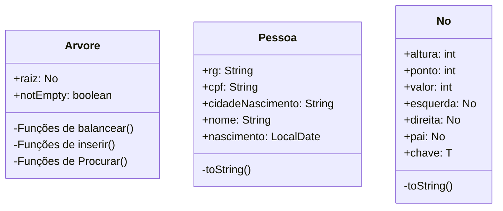
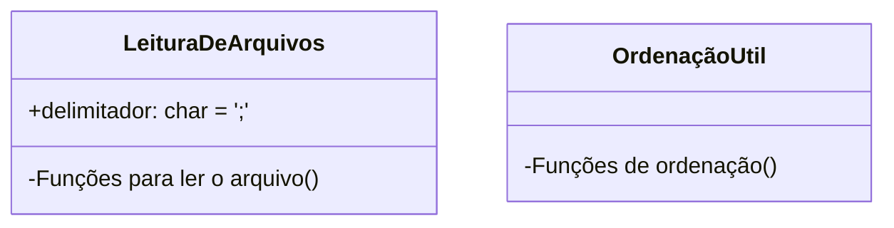
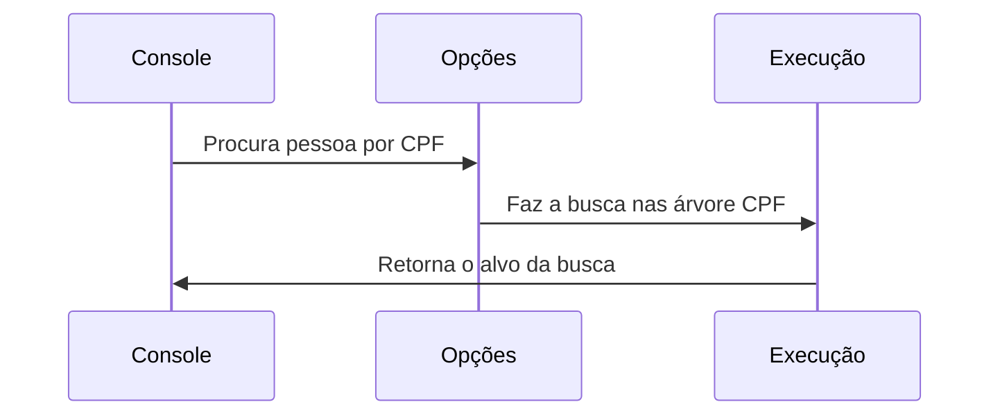

# Arvore Pessoa AVL

## Integrantes: Thais Landfeldt, Victório Faraco, João Trajano

# Como funciona
#### O programa é executado a partir da classe `Menu.java` possuindo uma  simples interface no log para melhor visualização

## **Classes Usadas** 
#### Tivemos como classes importantes para esse projeto um pilar bem sólido destas 3 classes destacadas

#### E também algumas funções de utilitários como as:

## Execução
#### O programa executa através da Classe Menu que faz uma execução no Console java. Aqui uma pequena demonstração de um fluxo no programa:

## Conclusão
#### Os modelos de Estruturas conhecidos como árvores possuem uma grande vantagem organizativa para buscas e consultas de `N` tipos de dados, e alguns modelos de árvores possuem vantagens para diferentes tipos de dados e funções a serem exercidas
